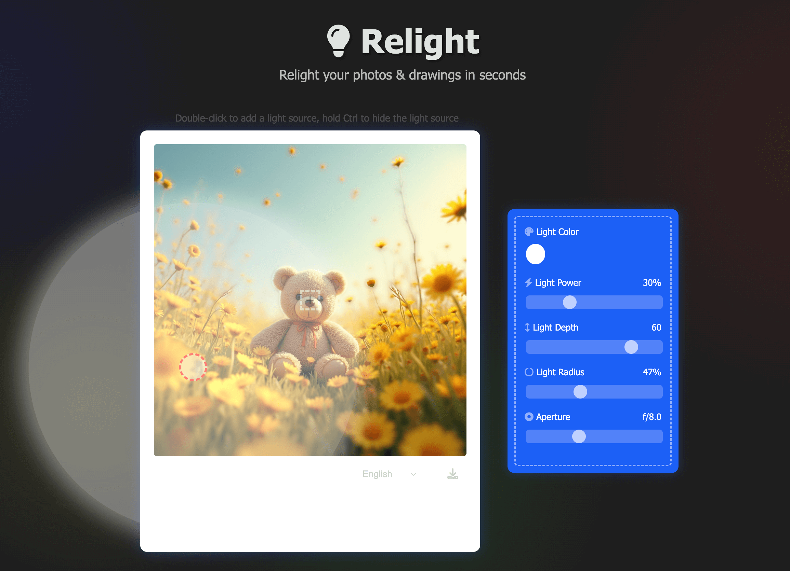

# Relight

<p align="center">
  <a href="https://github.com/lambertwooool/Relight/stargazers"></a>
  
  <a href="./LICENSE"></a>
</p>

---

### Introduction 🔎

Relight is an online tool that allows you to relight your photos and drawings in seconds. It uses advanced image processing techniques to let you easily adjust the lighting effects of your images.


### Development Tools 🛠️

Relight was developed entirely using Cursor in just one day, significantly improving development efficiency.


### Screenshot 📸

<p align="center">
  
</p>

### Features

✅ Multiple light sources: Add multiple light sources and adjust the color, intensity, depth, and radius of each

✅ Aperture adjustment: Adjust the aperture size to control depth of field effects

✅ Real-time preview: All adjustments can be previewed in real-time

✅ Multi-language support: Supports multiple languages including English, Chinese, and more

### How to Use

1. Open the website
2. Upload the image you want to process
3. Double-click on the image to add light sources, drag to adjust positions
4. Use the control panel to adjust light source parameters
5. Download the processed image when you're done

## Installation

To run Relight locally, follow these steps:

1. Clone the repository
   ```
   git clone https://github.com/lambertwooool/Relight.git
   cd relight
   npm install
   ```

2. Start the development server
   ```
   npm run dev
   ```

3. Open `http://localhost:3000` in your browser to access Relight